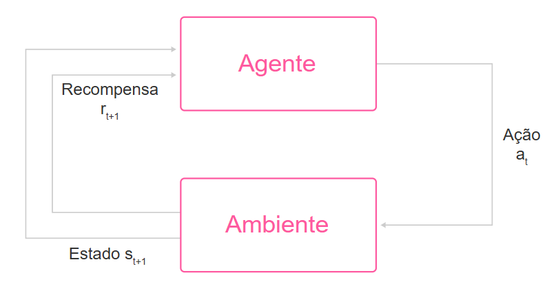

## Aprendizado por Reforço

O Aprendizado por Reforço (Reinforcement Learning, RL) é uma abordagem única de ML que **permite a um agente aprender a tomar decisões em um ambiente dinâmico, buscando maximizar uma recompensa acumulada**.

Um exemplo didático seria um adestramento de cães: o cão recebe um estímulo positivo (um petisco, por exemplo) após realizar uma ação desejada, como sentar ou deitar, reforçando o comportamento correto e incentivando-o a repeti-lo.

Diferente do aprendizado supervisionado, onde o modelo aprende com base em características e rótulos fornecidos, ou do aprendizado não supervisionado, onde descobre padrões em dados não rotulados, **o aprendizado por reforço permite que o agente aprenda com suas próprias experiências e interações**. Isso é particularmente útil para situações em que é necessário adaptar-se a um ambiente em constante mudança, ou onde as ações influenciam os próximos estados do sistema.

Este tipo de aprendizado se mostra essencial para resolver problemas complexos, como jogar xadrez, dirigir veículos autônomos, gerenciar sistemas de recomendação, etc. Pois ensina o agente a "aprender fazendo", ajustando suas estratégias com base nos feedbacks que recebe (recompensas ou punições).

### Componentes

- **Agente**: a entidade que toma ações no ambiente. Seu objetivo é aprender uma política que maximize a recompensa acumulada ao longo do tempo.
- **Ambiente**: O contexto no qual o agente interage e toma decisões. O ambiente responde às ações do agente, fornecendo novos estados e recompensas.
- **Ação**: as decisões ou movimentos que o agente pode tomar em um dado estado.
- **Estado**: A representação da situação atual do agente no ambiente. Um estado é atualizado com base na ação realizada pelo agente e representa informações sobre o ambiente.
- **Recompensa**: O feedback que o agente recebe após cada ação, indicando se sua decisão foi positiva ou negativa em relação ao objetivo final.

### Aplicações

- **Jogos**, onde o agente pode aprender estratégias vencedoras ao testar movimentos e avaliar o impacto de suas ações no resultado.
- **Robótica**, permite que robôs aprendam tarefas compelxas, como caminhar ou manipular objetos.
- **Finanças**, onde é usado para otimizar carteiras de investimento.

Outras aplicações incluem controle de tráfego, automação industrial e até saúde, onde o aprendizado por reforço auxilia no planejamento de tratamentos personalizados.

## Como funciona?

O agente aprende por tentativa e erro, testando diferentes ações e ajustando suas escolhas com base nas recompensas obtidas. Esse processo é chamado de:

- **Exploração** (*exploration*): testar ações para obter mais informações.
- **Explotação** (*exploitation*): escolher ações que já são conhecidas por maximizar a recompensa.

Inicialmente, o **o agente explora o ambiente, experimentando varias ações e observando os resultados**. À medida que acumula conhecimento, ele **começa a explotar ações que têm mais probabilidade de gerar recompensas positivas**. A chave do bom funcionamento e convergência é encontrar um bom equilíbrio entre ambas as abordagens.

#### Algoritmo **Q-Learning**

O algoritmo Q-Learning funciona ao atualizar uma tabela, chamada **Q-Table**, que armazena os valores de recompensa esperados para cada par de estado e ação.

Imagine que um agente está preso em um labirinto e precisa aprender como sair dele encontrando o caminho mais curto.

**Os passos do algoritmo são:**

- **1° Inicializar a Q-Table**: começa criando uma Q-table com todos os pares de estado e ação possíveis. Cada célula da Q-table começa com um valor inicial (geralmente zero), representando a recompensa esperada para cada ação em determinado estado.
- **2° Escolher uma ação (Exploration vs. Exploitation)**: no estado atual o agente precisa escolher uma ação. Ele pode explorar o ambiente escolhendo uma ação aleatória (exploração) ou optar pela ação que já oferece a maior recompensa estimada na Q-table (explotação). Esse equilíbrio entre exploração e explotação permite que o agente aprenda sobre o ambiente ao mesmo tempo que otimiza suas decisões.
- **3° Executar a ação e observar a recompensa**: o agente executa a ação escolhida, o que o leva a um novo estado do labirinto. Com base na ação, ele recebe uma recompensa (por exemplo, uma recompensa positiva caso se aproxime da saída do labirinto e uma negativa caso se colida com uma parede ou faça um movimento não produtivo).
- **4° Atualizar a Q-table**: o valor Q para o par de estado de ação é atualizado usando uma fórmula. Esse processo ajusta o valor na Q-table para refletir a recompensa atual e as recompensas futuras esperadas.
- **5° Repetir até o agente aprender**: o agente repete os passos 2 a 4 para múltiplas interações no ambiente, até que a Q-table converge para valores estáveis. Com o tempo, o agente aprende a escolher ações que maximizam a recompensa total, encontrando o caminho mais eficiente para a saída do labirinto.

**Após várias iterações, a Q-table do agente conterá as recompensas estimadas para todas as combinações de estado e ação, permitindo que ele tome decisões otimizadas**.