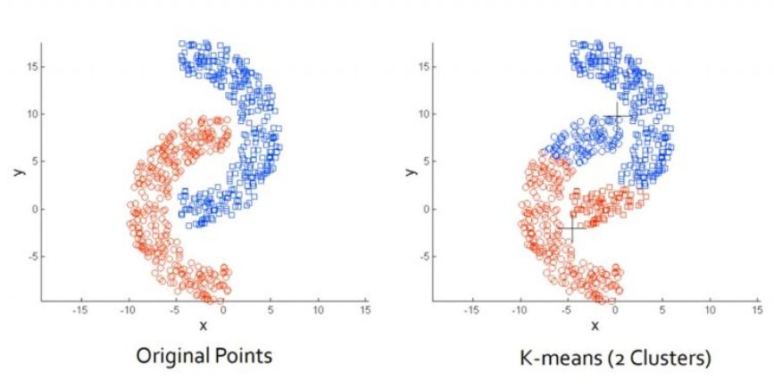

## Aprendizado não supervisionado com KMEANS e DBSCAN

### O que é Clusterização?

Esta técnica é utilizada para **segmentar dados e encontrar padrões ocultos**. A clusterização nos permite agrupar dados semalhantes e identificar grupos naturais em conjuntos de dados sem precisar de rótulos pré-definidos, **revelando padrões de comportamento ou perfis que não estavam evidentes**. 

Por exemplo, em um banco de dados de clientes de supermercado, a clusterização pode ajudar a segmentá-los (agrupa-los) em grupos de interesse baseado em características como idade, hábitos de compra ou renda, **sem que seja necessário dizer de antemão quais grupos existem**, permitindo estratégias personalizadas para cada segmento. 

Esse agrupamento gera insights (ideias, visões) valiosos, **mesmo quando não possuímos informações rotuladas previamente**.

### K-MEANS

O K-Means é um método de clusterização não supervisionado que visa dividir um conjunto de dados em K grupos (clusters) distintos, onde cada ponto é associado ao cluster com o centroide mais próximo (centroide é o centro do cluster).

A intruição por trás do K-Means: agrupar pontos que estejam próximos uns dos outros, e separar grupos distintos para maximizar a coesão dentro de cada cluster e a separação entre clusters.

**Importante:**
- Vale ressaltar que todo método baseado em distância exige a **normalização/padronização** das variáveis como etapa de pré-processamento dos dados. Isso facilita a convergência e impede a geração de hipóteses falsas sobre a importância de cada feature dentro do modelo.

#### Como funciona?

- Você escolhe um número K de grupos (clusters) que deseja encontrar nos seus dados.
- O algoritmo seleciona aleatoriamente **K pontos centrais** (chamados de *centroids*).
- Cada ponto do conjunto de dados é atribuído ao *centroide* mais próximo.
- Os centroides são recalculados com base na média dos pontos atribuídos a cada grupo.
- O processo de atribuição e atualização dos centroides é repetido até que os grupos parem de mudar (ou até atingir um número máximo de iterações).

Este tipo de algoritmo realiza o agrupamento dos dados baseado na proximidade de suas características, onde realiza esse agrupamento em "bolhas".

Vantagens:
- Simples e rápido para conjuntos de dados grandes.
- Funciona bem quando os clusters têm formatos arredondados (*esféricos*).
- Melhor para dados bem distribuídos, sem *outliers*.

Desvantagens:
- É necessário definir o número de clusters **K** antes de rodar o algoritmo.
- Não lida bem com clusters de formatos irregulares ou de tamanhos muito diferentes.
- Sensível a pontos iniciais (escolha dos centroides iniciais podem influenciar o resultado).
- É sensível a outliers, portanto, pode ser distorcido por pontos extremos (outliers).

### DBSCAN (Density-Based Spatial Clustering of Applications with Noise)

O DBSCAN é outro método de clusterização que agrupa pontos **com base na densidade**, no qual agrupa pontos que estão próximos uns dos outros em regiões de alta densidade, e identifica pontos dispersos como outliers ou ruído. A principal intuição do DBSCAN é que clusters são áreas densamente povoadas de pontos separados por áreas de baixa densidade.

Em outras palavras, um cluster no DBSCAN é uma **região onde há muitos pontos próximos uns dos outros**, enquanto áreas com poucos pontos são consideradas "vazias" (ou de **baixa densidade**) e são ignoradas como ruído.

O DBSCAN encontra automaticamente esses agrupamentos densos e ignora os pontos isolados, sem que você precise definir quandos grupos quer (como no K-Means). Portanto, ao contrário do K-Means, o DBSCAN não requer que o número de cluster seja definido antecipadamente e é eficas para detectar clusters de forma arbitrária, tornando-o adequado para dados que não seguem uma estrutura claramente definida.

Abaixo uma imagem para ilustrar a diferença entre pontos traçados pelo DBSCAN (esquerda) e K-means (direita).

DBSCAN busca regiões com a mesma densidade e o K-means ignora a densidade e se basea apenas na distância entre os pontos.

#### Como funciona?

O algoritmo usa dois parâmetros importantes:
    - **eps (epsilon)**: distância máxima para considerar que dois pontos são vizinhos (estão próximos).
    - **min_samples**: o número mínimo de pontos necessários para formar um cluster.

- O algoritmo escolhe um ponto aleatório e verifica quantos outros pontos estão dentro da distância **eps**.
- Se o número de pontos dentro da vizinhança for **maior ou igual** a *min_samples*, então ele forma um novo cluster.
- Se não houver pontos suficientes, o ponto é considerado um **ruído** (outlier).
- O processo continua expandindo os cluters até que todos os pontos sejam classificados.

Vantagens:
- Não precisa definir o número de clusters com antecedência.
- Funciona bem com clusters de formatos irregulares, ou seja, é capaz de encontrar grupos de diferentes formatos e tamanhos.
- Detecta *outliers* naturalmente (pontos isolados são marcados como ruído).
- Melhor para dados com densidade variável e *outliers*, portanto, marca os outliers como ruído.

Desvantagens:
- Pode ser lento para grandes conjuntos de dados.
- A escolha dos parâmetros (**eps** e **min_samples**) pode ser difícil e afetar muito o resultado.