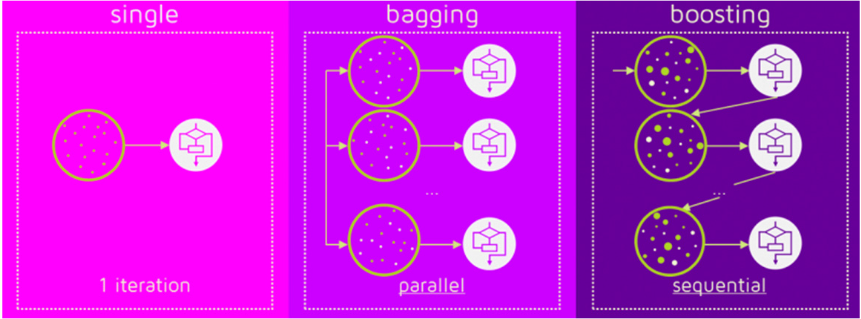
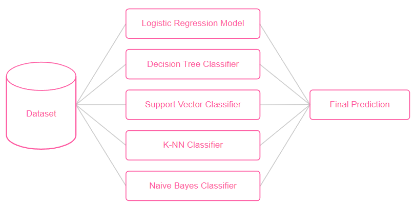
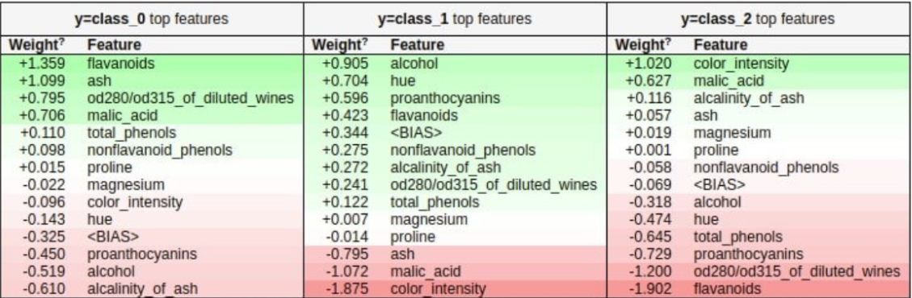
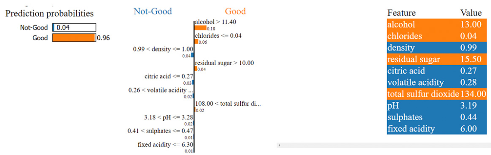
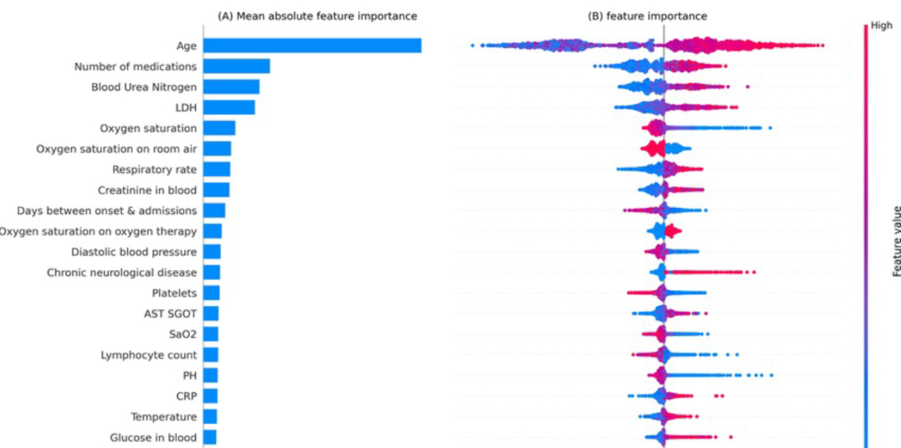

### Métodos de Ensemble

**Ensemble Learning** é uma abordagem em Machine Learning que busca combinar múltiplos modelos para criar um sistema mais robusto e eficaz. A ideia por trás dos métodos de ensemble é:
- Em vez de depender de um único modelo para fazer previsões, vários modelos são treinados e sesu resultados são combinados de forma a produzir uma resposta final que considera a contribuição de cada um.
- Modelos de ensemble podem gerar modelos preditivos com menos viés e menor variância ao combinar as forças de múltiplos modelos individuais.

#### Bagging

Bagging (Boostrap Aggregating) é uma técnica de ensemble que melhora a estabilidade e precisão de modelos. A ideia central do bagging é treinar vários modelos independentes em subconjuntos aleatórios de dados e combinar suas previsões.

**Como funciona?**
- O conjunto de dados original é dividido em vários subconjuntos por meio do bootstrap, criando múltiplas versões do dataset.
- Um modelo é treinado em cada subconjunto, podendo ser o mesmo tipo de algoritmo ou diferentes tipos.
- As previsões dos modelos são combinadas: em problemas de regressão, a média das previsões é usada; em problemas de classificação a combinação é realizada por **votação majoritária** (o resultado mais frequente é escolhido).

**Exemplos de técnicas de Bagging:**
- **Random Forest** é um dos exemplos mais populares de bagging. Onde ele utiliza várias árvores de decisão como modelos base e ao final, realiza a votação para retornar o resultado mais frequente como resposta do modelo.
- **BaggingClassifier** ou **BagginRegressor** pode ser utilizado para aplicar o bagging a qualquer algoritmo de base. Por exemplo, pode-se criar um ensemble de modelos de regressão linear ou KNN, e as previsões serão a média ou votação dos resultados individuais.

#### Boosting

Boosting é uma técnica de ensemble que melhora o desempenho de modelos de Machine Learning ao combinar vários modelos fracos em um modelo forte. Ao contrário do bagging, onde os modelos são treinados de forma independente, **no boosting os modelos são treinados sequencialmente, e cada novo modelo é ajustado para corrigir os erros dos modelos anteriores.** Essa abordagem foca em aprender com os erros, criando um modelo mais preciso a cada iteração.

**Como funciona?**
- Inicialmente, o primeiro modelo é treinado com pesos iguais para todas as observações.
- Em seguida, os dados nos quais o primeiro modelo cometeu erros recebem maior peso ou atenção.
- Um novo modelo é treinado levando em conta essas observações passadas, e suas previsões são combinadas com as do modelo anterior.
- Esse processo continua, com cada novo modelo focando em corrigir os erros acumulados pelos anteriores.
- No final, as previsões de todos os modelos são combinadas para formar a previsão final, frequentemente ponderada com base na precisão de cada modelo (da mais importância ou peso às previsões de modelos que apresentam melhor desempenho).

**Exemplos de técnicas de Boosting**
- **AdaBoost (Adaptive Boosting)**: O primeiro modelo é treinado e seus erros são identificados. Ems eguida o segundo modelo foca em corrirgir esses erros dando mais peso às observações que foram mal classificadas pelo primeiro modelo. Esse processo continua até que um número pré-definido de modelos seja criado. No final, as previsões são combinadas, geralmente com uma votação ponderada para classificação ou uma média ponderada para regressão. AdaBoost é conhecido por melhorar a precisão de modelos de classificação, especialmente em problemas onde os dados são lineares.
- **Gradient Boosting** e **XGBoost (Extreme Gradient Boosting)**: Nessa técnica, cada novo modelo é treinado para minimizar o erro residual (a diferença entre as previsões e os valores reais) dos modelos anteriores. Isso é feito de forma incremental, onde cada novo modelo tenta reduzir o erro do modelo anterior. O XGBoost é uma versão otimizada do Gradient Boosting, porém inclui melhorias de performance e velocidade, como regularização adicional para reduzir o overfitting.

#### Voting

Voting é uma técnica de ensemble que **combina as previsões de múltiplos modelos diferentes para gerar uma única previsão final**, de modo a aumentar a robustez e a precisão do modelo preditivo. Ao contrário do bagging e do boosting, em que geralmente se usa o mesmo tipo de modelo repetidamente (como múltiplas árvores de decisão), **o voting permite combinar diferentes algoritmos**, como uma combinação de modelos de árvore de decisão, regressão logística e KNN, para tirar proveito das forças de cada um.

**Como funciona?**
- **Voting Majoritário (Hard Voting)**: Nesse método, cada modelo gera uma previsão de classe para uma instância, e a classe que receber mais votos é a escolhida como previsão final.
- **Voting Ponderado (Soft Voting)**: Esse método leva em consideração as probabilidades preditivas de cada modelo. Cada modelo calcula a probabilidade de uma instância pertencer a cada classe, e a previsão final é feita com base na média dessas probabilidades ponderadas. Essa abordagem é útil quando alguns modelos são mais confiáveis que outros, permitindo que se atribuam pesos diferentes para cada modelo. Assim, modelos mais precisos podem ter maior influÊncia na decisão final.

#### Stacking

Stacking é uma técnica de ensemble que **combina as previsões de múltiplos modelos** (também chamados de "nível zero") **usand um modelo adicional** (chamado de "nível 1" ou "meta-modelo") **para fazer a previsão final**. Ao contrário de métodos como bagging ou boosting, em que as previsões de múltiplos modelos são combinadas diretamente (por votação ou média), o **stacking permite que o modelo de segundo nível aprenda como combinar as previsões dos modelos iniciais de forma mais sofisticada**.

**Como funciona?**
- **Nível Zero (Modelos Base)**: Vários modelos base são treinados no conjunto de dados original. Esses modelos podem ser de diferentes tipos, como árvores de decisão, regressão logística ou KNN, cada um com suas próprias características e pontos fortes.
- **Geração de Previsões para o Meta-Modelo**: Depois que os modelos de primeiro nível são treinados, **suas previsões para cada instância no conjunto de dados são salvas**. Em vez de fazer previsões diretamente no conjunto de teste, o stacking utiliza as previsões dos modelos de nível zero como features para o próximo modelo. Isso cria um novo conjunto de dados, onde cada coluna representa as previsões de um modelo base.
- **Nível 1 (Meta-Modelo)**: Um novo modelo é treinado usando as previsões dos modelos base como entradas. Esse meta-modelo aprende a combinar as previsões iniciais de forma a minimizar o erro final. O meta-modelo é, muitas vezes, um algoritmo simples, como uma regressão linear ou uma árvore de decisão, mas pode ser qualquer modelo que se adapte bem ao problema.

### Explicabilidade de Modelos

É sempre importante saber o *como* e os *porquês* das previsões de um modelo de Machine Learning. Portanto, é essencial saber, por exemplo, as variáveis mais importantes para a previsão da IA, o que indicaria os motivos de tal decisão.

A interpretabilidade se refere à capacidade de entender como um modelo chega às suas previsões e quais fatores influenciam suas decisões.

Modelos como Árvores de Decisão e Florestas Aleatórias já são nativamente interpretáveis (é possível visualizar as variáveis que mais influenciam na previsão). Porém, nem todas são diretamente interpretáveis. Para isto, temos algumas estratégias: ELI5, LIME e SHAP.

#### ELI5

ELI5 (Explain Like I'm 5) é especialmente útil para explicar modelos complexos, como **redes neurais** e **ensembles**, mas também pode ser aplicada a algoritmos mais interpretáveis, como regressão logística e árvores de decisão. A ferramenta oferece explicações detalhadas sobre a importância de cada feature para uma determinada previsão, ajudando a identificar quais variáveis estão influenciando o resultado.

Com o ELI5, é possível **visualizar os pesos das features** (para modelos lineares), as contribuições de cada variável em uma previsão específica e as interações que estão impactando as decisões do modelo.

Na imagem abaixo, é possível observar os pesos de algumas variáveis, de um contexto de previsão de uma vinicola, onde o objetivo é determinar, através das características do vinho, se um vinho é "bom" ou "ruim".

#### LIME

O método LIME (Local Interpretable Model-agnostic Explanations), **ao contrário de métodos que tentma interpretar o modelo como um todo, o LIME foca na explicação de previsões locais, ou seja, ele explica a decisão do modelo para uma única instância ou caso específico**. Essa abordagem é especialmente útil em modelos complexos e de "caixa-preta" (onde não é possível saber como funcionam por dentro), como redes neurais e ensembles, onde é difícil compreender diretamente como cada variável influencia a saída.

Na imagem abaixo, em uma instância particular, o modelo preditivo a classificou como bom com 96% de certeza. A parte central mostra as forças de interação de cada variável e seus *thresholds* (pontos de corte). O quadro à direita indica como as features contribuíram para a classificação (laranja para ser um vinho "bom" e azul para ser um vinho "ruim"). O método aponta que um vinho é considerado bom quando o teor alcóolico (alcohol) está acima de 11.40 (no caso da instância é 13), e o nível de cloreto (chlorides) deve ser menor ou igual a 0.04.

Esse tipo de método é muito valioso, pois responde perguntas do tipo "por que o modelo fez essa previsão?", proporcionando uma visão clara e intuitiva para usuários que precisam confiar nas previsões, tornando os modelos mais transparentes.

#### SHAP

O SHAP (SHapley Additive exPlanations) é uma técnica de interpretabilidade baseada na teoria dos jogos que **oferece explicações detalhadas sobre o impacto de cada variável nas previsões de um modelo de ML**. Inspirado nos valores de Shapley, usado em teoria dos jogos para distribuir recompensas de forma justa entre jogadores que contribuem para um resultado, o SHAP calcula a "contribuição" de cada feature para a previsão final. Dessa forma, ele atribui a cada variável um valor numérico que representa sua influência positiva ou negativa sobre a decisão do modelo.

**O grande diferencial do SHAP é a sua capacidade de fornecer explicações consistentes e globais para o comportamento do modelo, ao mesmo tempo em que permite analisar previsões individualmente**.

A imagem abaixo ilustra o diagrama SHAP de um modelo treinado para reocnhecer pessoas que podem evoluir a óbito em até 21 dias em decorrência da COVID-19.

A parte A ilustra a importância geral das features.

A parte B ilustra de que forma cada feature contribui para a predição.

A cor de cada ponto de dados representa o valor da feature, sendo que o vermelho corresponde a valores altos e o azul a valores baixos.

Valores de SHAP acima de 0 sugerem associação positiva com o desfecho, ou seja, contribuem para indicar que o paciente morrerá.

Valore de SHAP abaixo de 0 sugerem associação negativa com o desfecho, ou seja, contribuem para indicar que o paciente sobreviverá.

Desta forma, percebe-se que os fatores mais importantes para predizer a mortalidade do paciente é a **idade do paciente, quantos medicamentos administra** e uma **porção de indicadores de saúde**.

No caso da "idade", quanto menor (mais azul), mais o SHAP tenderia para o negativo, portanto, maior a chance de sobrevivência do paciente. Por outro lado, quanto maior a idade (mais vermelho), mais o SHAP tenderia para o positivo, indicando uma possível morte em até 21 dias.

O campo "oxygen saturation", de modo simplificado, este índice mede a capacidade da pessoa respirar. Quanto menor o nível de saturação (valores em azul), maior a chance de a pessoa vir a óbito.